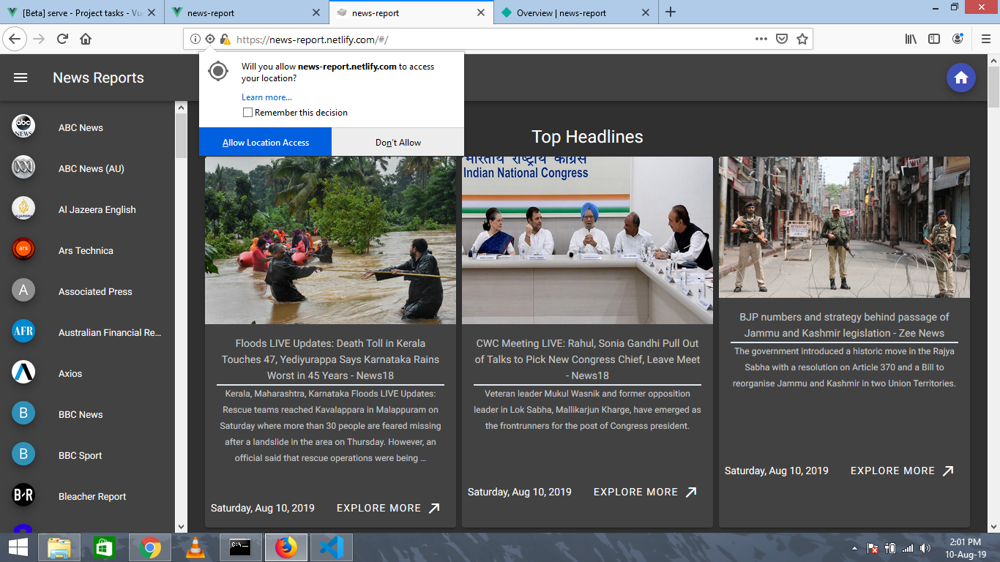
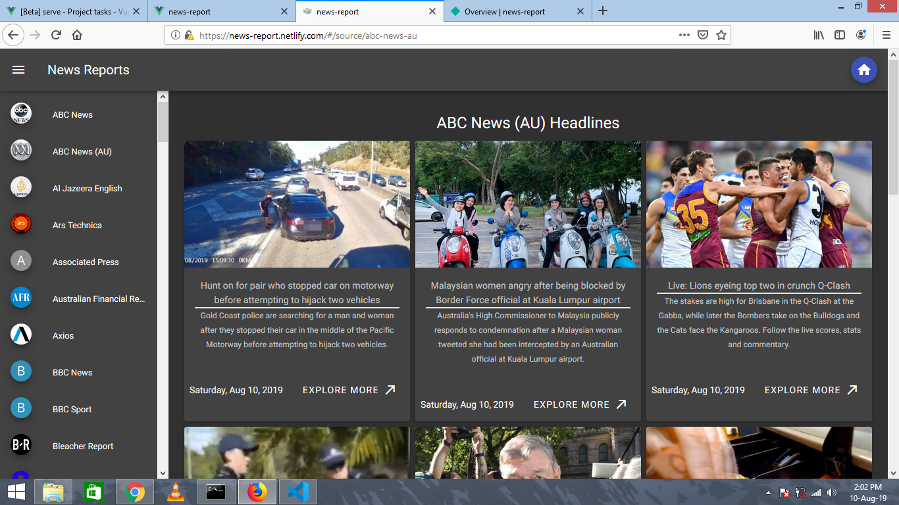
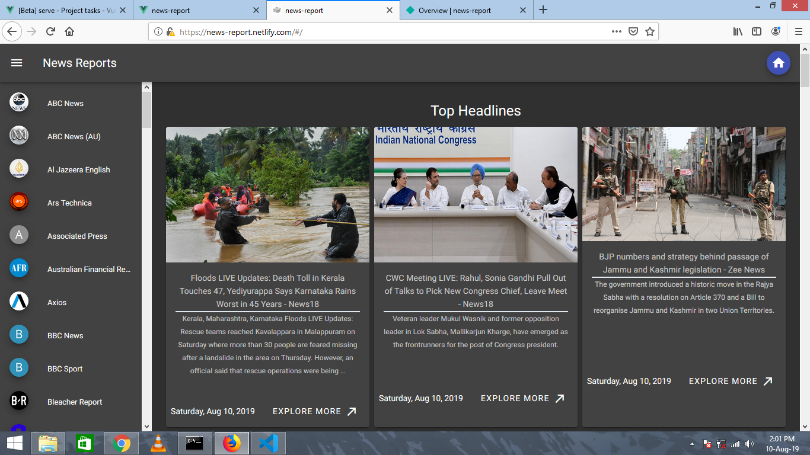

# News-report
App to see the top headlines from across various sources, build using "newsapi", Vue,Vuetify.

For API Documentation visit [https://newsapi.org/](https://newsapi.org/)

See live demo [here](https://news-report.netlify.com/#/)

## Screenshots

### 1. Landing Page



Note: User is prompted to allow location access to view the Top headlines in his/her country.

### 2. Sources page




### 3. Top Headlines


## Project setup
```
npm install
```

### Compiles and hot-reloads for development
```
npm run serve
```

### Compiles and minifies for production
```
npm run build
```

### Run your tests
```
npm run test
```

### Lints and fixes files
```
npm run lint
```

### Customize configuration
See [Configuration Reference](https://cli.vuejs.org/config/).
